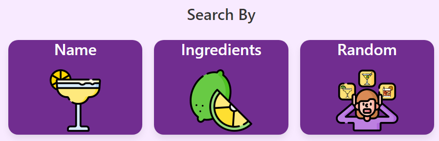
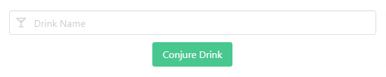

# Cocktail Wizard
A simple cocktail recipe webapp
---
---
## Description

This webapp allows the user to search for a cocktail recipe three different ways.

We needed to become more proficient in utilizing third-party/server-side APIs and, more specifically, force ourselves to work with only what was available from a given API. There were ideas that we had to stop pursuing because of API limitations, and knowing when to stop chasing an impossible goal was a great lesson to learn.

The Cocktail Wizard webapp helps take some of the guesswork out of finding a drink recipe based on what ingredients you currently have at your disposal. You shouldn't have to search multiple places to find a recipe, ingredients, and instructions so we tried to utilize a cocktail search API to put all of that information in one place

---
## Installation

N/A

---
## Usage

Project Repository (you are here): [Click here!](https://github.com/Zgibbs58/drink-recipe-finder)

Deployed Application: [Click here!](https://zgibbs58.github.io/drink-recipe-finder/)

To use this webapp the first thing you'll need to do is determine how you would like to search for a drink recipe. You can search by drink name, drink ingredient, or choose a random recipe, as shown above.

If you choose to search by name or ingredient you will be presented with a modal containing an input field to input what you want to search for.

After the user inputs their desired search parameters all you have to do is click the 'conjure drink' button and the webapp will fetch the data and populate the results.html with the recipe.

The results page will contain a drink name, an image of said drink, drink ingredients, drink instructions, and video instructions (*if a video exists within thecoctaildb API*).

---
## Technologies Used

[thecocktaildb API](https://www.thecocktaildb.com/api.php) - Used to fetch data pertaining to a specific drink, ingredient or random drink.

[YouTube Embed API](https://developers.google.com/youtube) - Used to generate an iframe tag in the HTML of the results page which allows us to display a video as fetched by thecocktaildb API.

---
## Contributors

[Zgibbs58](https://github.com/Zgibbs58)

[t-willis](https://github.com/t-willis)

---
## Credits

https://www.flaticon.com/ - Clipart for 'search by' cards

https://favicon.io/emoji-favicons/ - Favicon generator